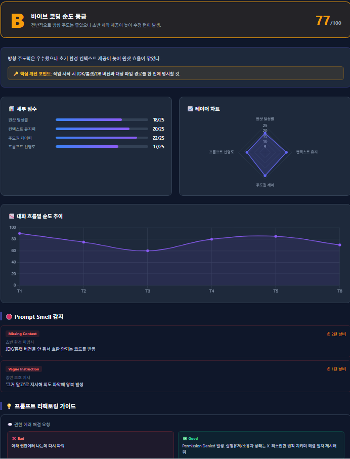
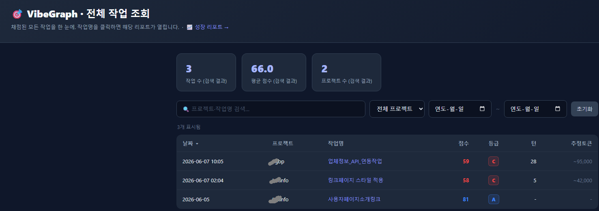
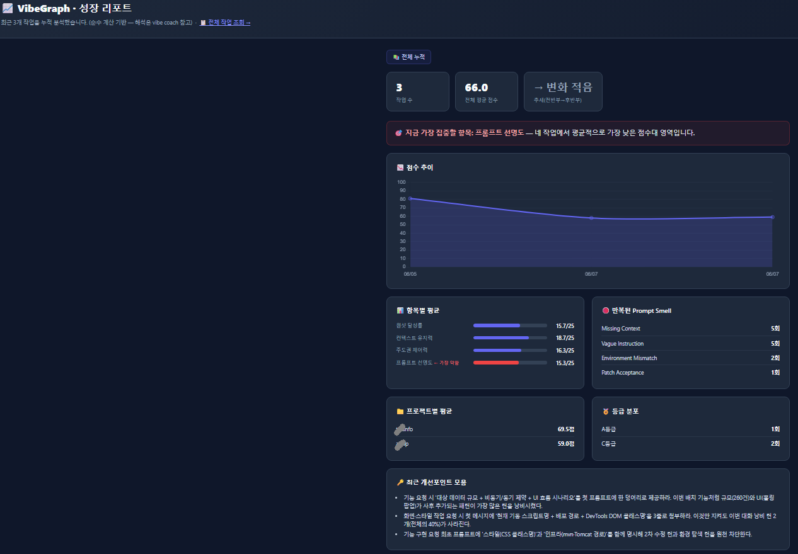

# 🎯 VibeGraph

> 바이브코딩(AI 페어 프로그래밍) 대화의 **순도**를 사후 채점하고, 성장 흐름을 추적하는 CLI
>
> *Score your AI-pair-programming sessions and track your growth — no API key required.*


작업이 끝날 때마다 "이번 대화에서 내가 AI를 얼마나 잘 이끌었나"를 4개 항목(각 25점)으로 채점하고,
HTML 리포트 · 조회 페이지 · 누적 성장 리포트 · 맞춤 코칭까지 만들어 줍니다.

**별도 API 키·추가 결제가 필요 없습니다.** 채점은 평소 쓰던 Claude Code 창에서 이뤄집니다(Pro/Max 구독으로 커버).

---

## 📑 목차
- [왜 만들었나](#-왜-만들었나)
- [특징](#-특징)
- [스크린샷](#-스크린샷)
- [작동 방식](#-작동-방식)
- [요구 사항](#-요구-사항)
- [설치](#-설치)
- [기본 사용법](#-기본-사용법)
- [데이터 저장 위치](#-데이터-저장-위치)
- [왜 API 키가 필요 없나](#-왜-api-키가-필요-없나)
- [라이선스](#-라이선스)

## 🤔 왜 만들었나

AI와 함께 코딩하다 보면 같은 실수를 반복합니다 — 요구사항을 한 번에 안 주고 여러 번 고치게 만들거나,
모호하게 지시했다가 엉뚱한 결과를 받거나, AI의 땜질 제안에 끌려가거나.
**VibeGraph는 매 작업이 끝난 뒤 그 대화를 스스로 채점**해서, 무엇을 고치면 다음엔 더 잘할지 알려줍니다.
점수를 쌓아 **나의 프롬프트 습관이 좋아지고 있는지**도 추적합니다.

## ✨ 특징

- **4축 채점** — 원샷 달성률 · 컨텍스트 유지력 · 주도권 제어력 · 프롬프트 선명도
- **API-free** — 대화 맥락을 가진 Claude 창에서 직접 채점 (외부 API 호출·추가 결제 없음)
- **개별 리포트** — 점수 · 레이더 차트 · Prompt Smell · Good/Bad 예시 · 대체 스킬 추천
- **전체 조회 페이지** (`index.html`) — 검색 · 프로젝트 · 기간 필터, 정렬, 필터 결과 KPI
- **성장 리포트** (`growth.html`) — 점수 추세, 가장 약한 항목, 반복 스멜, 프로젝트별 평균
- **누적 코칭** (`vibe coach`) — 계산으로 추출한 신호를 근거로 한 맞춤 코칭 (억지 분석 방지)
- **Claude Code Skill** — `/vibe report` 한 줄로 현재 대화 자동 채점·리포트 완결

## 📸 스크린샷

| 개별 리포트 | 전체 조회 | 성장 리포트 |
|---|---|---|
|  |  |  |

> 샘플 리포트를 바로 보려면 저장소를 클론한 뒤 `sample_report.html` 을 더블클릭하세요.

## ⚙️ 작동 방식

**방식 A — 수동 (기본, 터미널)**

```
[터미널]                         [Claude Code 창]
vibe start  ──────────────▶  평소처럼 코딩 작업
                                   │
vibe prompt ──(채점 프롬프트 복사)──▶ 붙여넣기 → Claude가 이번 대화를
                                   │            스스로 채점한 JSON 출력
result.json 에 JSON 저장 ◀──────────┘

vibe end    ──▶ report.html · index.html · growth.html 생성
```

**방식 B — 자동 (Claude Code Skill 등록 후)**

```
[채점할 대화 창에서만]

/vibe start <project> <task>   ← 세션 시작
/vibe report                   ← Claude가 이 대화를 직접 채점 + report.html 자동 생성
```

방식 B는 클립보드·붙여넣기·JSON 저장 없이 두 줄로 완결됩니다.
소급 채점도 동일 방식 — 이미 끝난 대화에서 start → report 바로 실행 가능.

## 📦 요구 사항

- Windows 10/11
- Python 3.9+ ([python.org](https://www.python.org/downloads/) — 설치 시 **"Add Python to PATH"** 체크)
- Claude Code (Pro/Max 구독)

## 🚀 설치

### 방법 1 — pip 설치 (권장)

```powershell
pip install git+https://github.com/seamoon23/vibegraph.git
```

`vibe` 명령이 PATH에 자동 등록됩니다. 이후 [Skill 등록](#-claude-code-skill-등록-선택)을 진행하면 Claude 창에서도 사용할 수 있습니다.

### 방법 2 — 로컬 클론 후 bat 설치 (대안)

```bash
git clone https://github.com/seamoon23/vibegraph.git
```

폴더 안의 **`install.bat`** 을 더블클릭합니다. (Python 확인 + `vibe` 명령 PATH 등록)

> 💡 설치 후 `vibe` 가 "인식되지 않습니다"라고 나오면, **VS Code를 완전히 종료 후 재실행**하거나 **새 PowerShell 창**을 여세요.

### 🤖 Claude Code Skill 등록 (선택)

> pip 설치든 bat 설치든 동일하게 진행합니다.

```powershell
vibe install-skill
```

이후 **VS Code를 완전히 재시작**하면 Claude Code 창에서 `/vibe` 명령을 사용할 수 있습니다.

## 🧭 기본 사용법

### 터미널 방식

```bash
vibe start <프로젝트> <작업명>   # 작업 시작 (작업명에 공백 가능)
#  … Claude Code로 평소처럼 작업 …
vibe prompt                      # 채점 프롬프트 복사 + result.json 열기
#  → 작업하던 Claude 창에 붙여넣기 → 나온 JSON을 result.json 에 저장
vibe end                         # 리포트(report.html) 생성 + 조회/성장 페이지 갱신
```

### Skill 방식 (등록 후)

```
/vibe start <프로젝트> <작업명>   ← Claude 창에서 실행
/vibe report                      ← 채점 + 리포트 자동 완결
```

### 전체 명령어

| 명령 | 설명 |
|---|---|
| `vibe start <project> <task>` | 새 작업 세션 시작 |
| `vibe prompt` | 채점 프롬프트 복사 + `result.json` 열기 |
| `vibe report` | `result.json` 있으면 리포트 생성, 없으면 프롬프트 복사 (통합) |
| `vibe end` | `result.json` 으로 리포트 생성 (+ 조회/성장 페이지 자동 갱신) |
| `vibe list [project]` | 작업 목록 |
| `vibe stats [--weeks N]` | 기간별 통계 |
| `vibe dashboard` | 전체 작업 조회 페이지 (= `view`, `index`) |
| `vibe growth` | 성장 리포트 — 기본 **최근 2주** (`--all` 전체 · `--weeks N` · `--project <이름>`) |
| `vibe coach` | 누적 신호 기반 코칭 프롬프트 복사 |
| `vibe install-skill` | Claude Code Skill 파일 설치 (`~/.claude/skills/vibe.md`) |

> ⏱ **성장 리포트 기본 기간이 "최근 2주"인 이유**: 전체를 기본으로 하면 작업이 쌓일수록 집계가 느려지고 추세 차트가 복잡해집니다. 전체 흐름은 `vibe growth --all` 로 확인하세요.

자세한 흐름은 **`가이드.html`** (더블클릭) 또는 **`사용법.txt`** 를 참고하세요.

## 📁 데이터 저장 위치

채점 데이터는 **코드와 분리**되어 사용자 폴더에 쌓입니다.

```
~/.vibegraph/                     (= %USERPROFILE%\.vibegraph)
 ├ index.html        전체 작업 조회 페이지
 ├ growth.html       누적 성장 리포트
 └ <프로젝트>/<날짜_작업명>/
     ├ result.json   Claude가 출력한 채점 결과
     ├ data.json     최종 점수 데이터(통계 연동)
     └ report.html   개별 리포트
```

- 저장 위치를 바꾸려면 환경변수 **`VIBE_HOME`** 에 원하는 경로를 지정하세요.
- 구버전(코드 폴더에 데이터가 쌓이던 방식)에서 올라오면, 첫 실행 때 데이터를 사용자 폴더로 **자동 이전**합니다.

## 🔒 왜 API 키가 필요 없나

채점을 *작업하던 Claude Code 창*에서 하기 때문입니다. 그 창은 이미 대화 맥락을 갖고 있어,
프롬프트만 붙여넣으면 스스로 채점 JSON을 출력합니다. 이 CLI는 폴더 정리·HTML 생성·통계만 담당하며 외부 API를 호출하지 않습니다.

## 📄 라이선스

[MIT](LICENSE) © 2026 seamoon23
